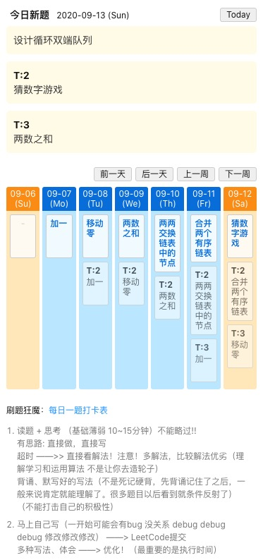

# 5Times

五毒神掌 TODO List 工具

```
cd packages/app-5times-todoist 
npm run start
```



手动添加算法题，或者需要做的强化练习。

更改数据地址：/package/app-5times-todoist/src/algorithm.js

目前设置需重复练习的时间间隔。
```
export const timesIntervalEnum = {
	1: 0,
	2: 1,
	3: 4,
	4: 7,
	5: 14,
};
```

添加算法题：
```
export const algorithmData = {
	'2020-09-07': [
		{
			title: '加一',
			linkUrl: 'https://leetcode-cn.com/problems/plus-one/',
		},
	],
    ...
}
```

